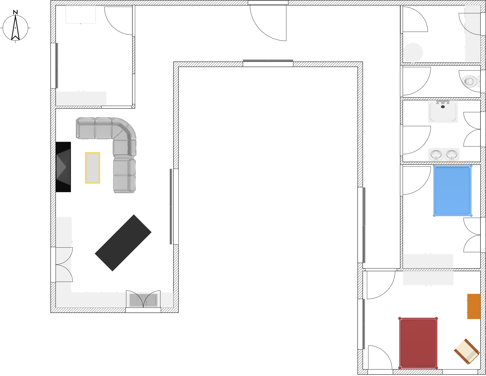
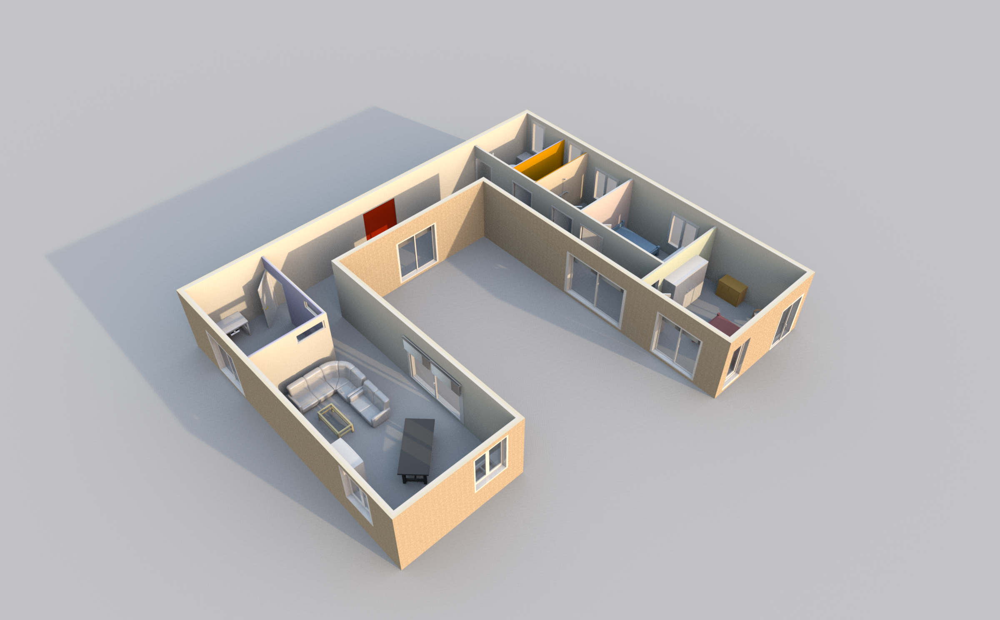

# Shipping containers house

The idea here is to build a great and cheap custom house, using shipping containers as the main structural elements.

The current view uses only five 40" High-Cube containers. Two other containers could be used to make a garage. One more for a pool house…

The plan has been made using [*Sweet Home 3D*](http://www.sweethome3d.com/) with an SVG export so it can be viewed anywhere.

# Inside the house

The current plan involves a simple house with big living spaces for a couple or a small family.

* 2 bedrooms
* 1 bathroom
* 1 toilet
* 1 laundry room
* 1 office (could become a bedroom)
* 1 living/kitchen area

# Outside the house

The goal is to have the house surrounded by trees on the East and West sides, with the road up North and some free space South. This should allow for some nice benefits:

* 1 big terrace/patio area
* 1 small terrace (master bedroom)
* Several parking spaces
* Possible future garage (near the office)
* Natural swimming pool

# Environment

The goal here is to use as much upcycled or recycled materials to build the house, as well as make it self-sustaining.

## Heating

Many solutions are possible. Most likely geo-thermal would be best.

Otherwise good old electricity can be a suitable backup.

## Lighting

Big windows inside the U shape should allow for a continuous flow of light throughout the day. The West wing being a little behind should allow for more light on the terrace (perfect for late summer parties).

## Electricity

*Solar panels* are an obvious solution here (the roof should be big enough to install a few), though some [*Savonius Vertical Axis Wind Turbines*](https://www.youtube.com/watch?v=Wlxz-KzebbQ) could also be used as they require little maintenance and use less dangerous materials.

Storage means finding some batteries. Maybe Tesla Powerwalls? Big batteries should allow for 2 to 3 days worth of juice. Excess can be put back into the grid.

## Water

The roof area should be large enough to allow water recovery into some reservoirs.

A filtration system should be put in place to be able to use this water as a drinking/washing solution, as well as a pump.

Regular water network is also needed in case all the reservoirs become empty.
